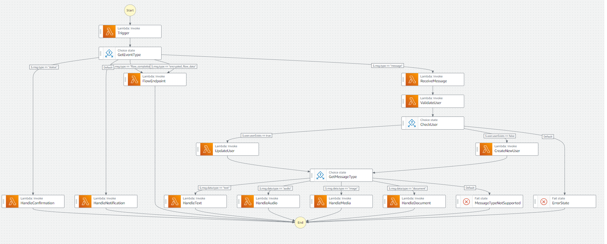

# Arquitectura de Step Function


# Creación de arquitectura
Para crear y configurar una función Lambda localmente y luego subirla a AWS con Boto3 en Python, sigue estos pasos:

1. **Crea el código de la Lambda localmente**:
   - Escribe el código de tu función Lambda en un archivo Python en tu máquina local. Por ejemplo, digamos que tienes un archivo llamado `my_lambda_function.py` con el siguiente contenido:

```python
def lambda_handler(event, context):
    return {
        'statusCode': 200,
        'body': 'Hello from Lambda!'
    }
```

2. **Empaqueta el código Lambda**:
   - Comprime tu función Lambda y sus dependencias en un archivo zip. Asegúrate de incluir todas las dependencias necesarias junto con tu archivo de función. Por ejemplo, si tu función depende de bibliotecas de terceros, inclúyelas en el archivo zip.

3. **Carga el archivo zip a AWS Lambda**:
   - Utiliza Boto3 para cargar tu archivo zip a AWS Lambda y crear la función Lambda. Aquí tienes un ejemplo:

```python
import boto3

lambda_client = boto3.client('lambda',
    aws_access_key_id='TU_ACCESS_KEY_ID',
    aws_secret_access_key='TU_SECRET_ACCESS_KEY',
    region_name='TU_REGION'
)


environment_variables = {
    'Variable1': 'Value1',
    'Variable2': 'Value2'
}

with open('lambda_function.zip', 'rb') as f:
    zip_file = f.read()

response = lambda_client.create_function(
    FunctionName='MyLambdaFunction',
    Runtime='python3.8',
    Role='arn:aws:iam::123456789012:role/lambda-role',
    Handler='my_lambda_function.lambda_handler',
    Code={
        'ZipFile': zip_file
    },
    Environment={
        'Variables': environment_variables
    },
    Layers=[
        'arn:aws:lambda:region:account-id:layer:my-layer-name:1'  # Reemplaza con el ARN de tu capa
    ]
)
```

4. **Obtén el ARN de la función Lambda**:
   - Después de crear la función Lambda, necesitas obtener su ARN.

```python
lambda_arn = response['FunctionArn']
```

5. **Actualiza la definición de la Step Function**:
   - Luego, actualiza la definición de tu Step Function para asociar la función Lambda con sus variables de entorno. Aquí hay un ejemplo:

```python
state_machine_definition = {
    "Comment": "A simple AWS Step Functions state machine that invokes a Lambda function",
    "StartAt": "InvokeLambda",
    "States": {
        "InvokeLambda": {
            "Type": "Task",
            "Resource": "arn:aws:lambda:us-east-1:123456789012:function:MyLambdaFunction",
            "End": True
        }
    }
}
```

6. **Crea y Actualiza la Step Function**:
- Utiliza el método `create_state_machine` de Boto3 para crear   la definición de tu Step Function.
```python 
stepfunctions_client = boto3.client(
    'stepfunctions',
    aws_access_key_id='TU_ACCESS_KEY_ID',
    aws_secret_access_key='TU_SECRET_ACCESS_KEY',
    region_name='TU_REGION'
)

response = stepfunctions_client.create_state_machine(
    name='MyStateMachine',
    definition=json.dumps(state_machine_definition),
    roleArn='ARN_del_Rol_de_Ejecución'
)

state_machine_arn = response['stateMachineArn']
```

   - Utiliza el método `update_state_machine` de Boto3 para actualizar la definición de tu Step Function.

```python
response = stepfunctions_client.update_state_machine(
    stateMachineArn='ARN_de_tu_StepFunction',
    definition=json.dumps(state_machine_definition)
)
```

Recuerda reemplazar `'ARN_de_tu_StepFunction'` con el ARN de tu Step Function.

Con estos pasos, habrás creado una función Lambda localmente y la habrás subido a AWS, luego la habrás asociado a tu Step Function utilizando Boto3 en Python.


# Variables de entorno en JSON
Para utilizar variables de entorno en un archivo JSON en Python, puedes cargar el JSON y luego reemplazar las variables de entorno con sus valores correspondientes. Aquí tienes un ejemplo de cómo hacerlo:

Supongamos que tienes un archivo JSON llamado `config.json` con el siguiente contenido:

```json
{
  "database": {
    "host": "${DB_HOST}",
    "port": "${DB_PORT}",
    "username": "${DB_USERNAME}",
    "password": "${DB_PASSWORD}"
  }
}
```

Y tienes variables de entorno definidas para `DB_HOST`, `DB_PORT`, `DB_USERNAME` y `DB_PASSWORD`.

Puedes cargar este JSON en tu script Python y luego reemplazar las variables de entorno con sus valores utilizando `os.environ`:

```python
import json
import os

# Carga el archivo JSON
with open('config.json') as f:
    config = json.load(f)

# Reemplaza las variables de entorno con sus valores
def replace_env_variables(obj):
    if isinstance(obj, dict):
        for key, value in obj.items():
            obj[key] = replace_env_variables(value)
    elif isinstance(obj, str) and obj.startswith('${') and obj.endswith('}'):
        env_var = obj[2:-1]  # Extrae el nombre de la variable de entorno
        obj = os.environ.get(env_var, obj)  # Obtiene el valor de la variable de entorno
    return obj

config = replace_env_variables(config)

# Ahora config contiene el JSON con las variables de entorno reemplazadas por sus valores
print(config)
```

Este script cargará el JSON, buscará las variables de entorno en forma de `${VAR}` y las reemplazará con sus valores correspondientes de `os.environ`. Después de ejecutar este script, `config` contendrá el JSON con las variables de entorno reemplazadas por sus valores.

## con jinja2 
Claro, aquí tienes un ejemplo más elaborado que incluye la definición de un JSON con múltiples variables de entorno y su posterior reemplazo utilizando la biblioteca `jinja2`:

Supongamos que tienes un archivo JSON llamado `config.json` con la siguiente estructura:

```json
{
  "database": {
    "host": "${DB_HOST}",
    "port": "${DB_PORT}",
    "username": "${DB_USERNAME}",
    "password": "${DB_PASSWORD}"
  },
  "api": {
    "url": "${API_URL}",
    "token": "${API_TOKEN}"
  },
  "logging": {
    "level": "${LOG_LEVEL}",
    "file_path": "${LOG_FILE_PATH}"
  }
}
```

Ahora, vamos a escribir un script Python para cargar este JSON, reemplazar las variables de entorno y luego imprimir el resultado:

```python
import json
import os
from jinja2 import Template

# Cargar el contenido del archivo JSON
with open('config.json', 'r') as file:
    json_content = file.read()

# Crear una plantilla de Jinja2
template = Template(json_content)

# Definir variables de entorno simuladas (para propósitos de demostración)
os.environ['DB_HOST'] = 'localhost'
os.environ['DB_PORT'] = '5432'
os.environ['DB_USERNAME'] = 'user'
os.environ['DB_PASSWORD'] = 'password'
os.environ['API_URL'] = 'https://api.example.com'
os.environ['API_TOKEN'] = 'abc123'
os.environ['LOG_LEVEL'] = 'debug'
os.environ['LOG_FILE_PATH'] = '/var/log/app.log'

# Renderizar la plantilla con las variables de entorno
rendered_json = template.render(env=os.environ)

# Convertir el JSON renderizado a un diccionario de Python
config = json.loads(rendered_json)

# Imprimir el resultado
print(json.dumps(config, indent=4))
```

Este script cargará el contenido del archivo `config.json`, definirá variables de entorno simuladas utilizando el diccionario `os.environ`, reemplazará las variables de entorno en el JSON utilizando la plantilla de Jinja2 y luego imprimirá el resultado final con las variables de entorno reemplazadas.